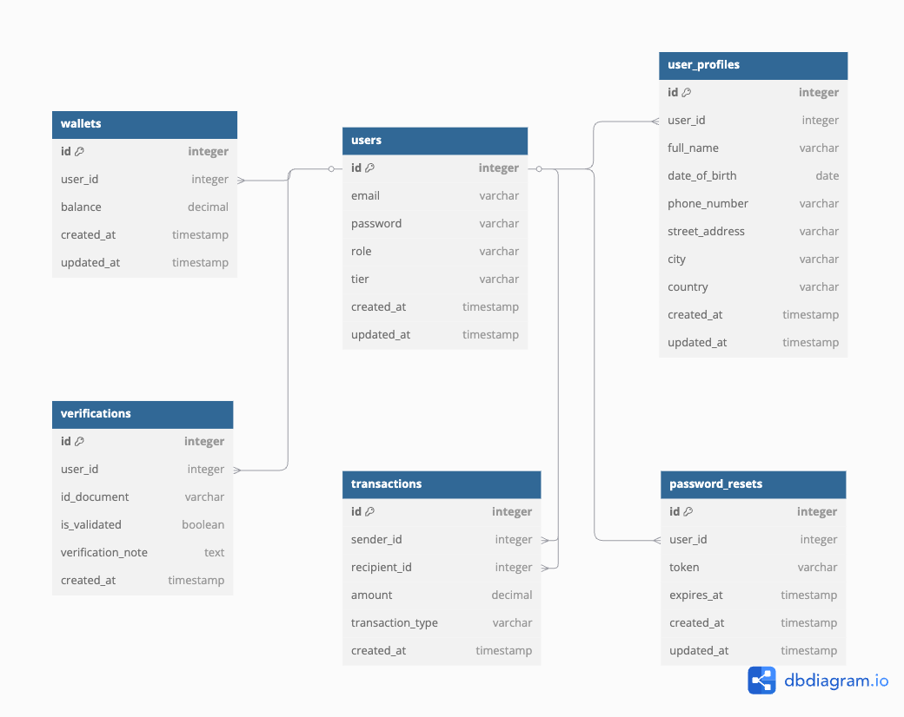

# senior-dweb3
# Digital Wallet Platform

## Overview
The **Digital Wallet Platform** is a secure, scalable solution for managing user balances, performing financial transactions (deposits, withdrawals, and transfers), and handling authentication workflows. It also supports QR-based payments and includes robust password management and verification features.

---

## Diagrams

### ER Diagram


### Component Diagram


---

## Hosting Details
- **Server IP:** [http://ec2-13-38-91-228.eu-west-3.compute.amazonaws.com/](http://ec2-13-38-91-228.eu-west-3.compute.amazonaws.com/)
- **Documentation URL:** [https://abbass-hassan.github.io/digital-wallet-platform/](https://abbass-hassan.github.io/digital-wallet-platform/)

---


# Digital Wallet Platform API Documentation

## Overview
This API provides endpoints for user authentication, transactions, and wallet management. It enables third-party integrations to access user balance, perform transfers, withdrawals, and deposits securely.

## Authentication
All API requests require authentication via a JWT token in the Authorization header.

**Header Format:**
```http
Authorization: Bearer YOUR_JWT_TOKEN
```

---

## User Authentication
### Register a New User
**Endpoint:** `/user/v1/auth/register.php`
**Method:** `POST`
**Request Body:**
```json
{
  "email": "user@example.com",
  "password": "securepassword",
  "confirm_password": "securepassword"
}
```
**Response:**
```json
{
  "status": "success",
  "message": "Registration successful"
}
```

### User Login
**Endpoint:** `/user/v1/auth/login.php`
**Method:** `POST`
**Request Body:**
```json
{
  "email": "user@example.com",
  "password": "securepassword"
}
```
**Response:**
```json
{
  "token": "your_jwt_token"
}
```

---

## Wallet Management
### Get User Balance
**Endpoint:** `/user/v1/get_balance.php`
**Method:** `GET`
**Headers:**
```http
Authorization: Bearer YOUR_JWT_TOKEN
```
**Response:**
```json
{
  "balance": 150.75
}
```

### Deposit Funds
**Endpoint:** `/user/v1/deposit.php`
**Method:** `POST`
**Request Body:**
```json
{
  "amount": 100.00
}
```
**Response:**
```json
{
  "newBalance": 250.75,
  "message": "Deposit successful"
}
```

### Withdraw Funds
**Endpoint:** `/user/v1/withdraw.php`
**Method:** `POST`
**Request Body:**
```json
{
  "amount": 50.00
}
```
**Response:**
```json
{
  "newBalance": 200.75,
  "message": "Withdrawal successful"
}
```

---

## Transactions
### Transfer Funds
**Endpoint:** `/user/v1/transfer.php`
**Method:** `POST`
**Request Body:**
```json
{
  "recipient_email": "recipient@example.com",
  "amount": 25.00
}
```
**Response:**
```json
{
  "new_balance": 175.75,
  "message": "Transfer successful."
}
```

### Get User Transactions
**Endpoint:** `/user/v1/get_transactions.php`
**Method:** `GET`
**Response:**
```json
[
  {
    "id": 1,
    "type": "deposit",
    "amount": 100.00,
    "date": "2025-03-05"
  },
  {
    "id": 2,
    "type": "withdrawal",
    "amount": 50.00,
    "date": "2025-03-06"
  }
]
```

---

## Security & Verification
### Request Password Reset
**Endpoint:** `/user/v1/request_password_reset.php`
**Method:** `POST`
**Request Body:**
```json
{
  "email": "user@example.com"
}
```
**Response:**
```json
{
  "message": "If an account with that email exists, a password reset link has been sent."
}
```

### Reset Password
**Endpoint:** `/user/v1/reset_password.php`
**Method:** `POST`
**Request Body:**
```json
{
  "token": "reset_token",
  "new_password": "newsecurepassword"
}
```
**Response:**
```json
{
  "message": "Password successfully reset."
}
```

---

## QR Code Payments
### Generate QR Code for Payments
**Endpoint:** `/utils/generate_qr.php`
**Method:** `GET`
**Response:**
Returns a PNG image of a QR Code that links to a payment request.

### Receive Payment via QR Code
**Endpoint:** `/user/v1/receive_payment.php`
**Method:** `POST`
**Request Body:**
```json
{
  "recipient_id": 123,
  "amount": 10.00
}
```
**Response:**
```json
{
  "newBalance": 160.75,
  "message": "Payment received successfully."
}
```

---

## Error Handling
All API responses will return a JSON error message in case of failure:
```json
{
  "error": "Error message details here"
}
```

## Notes
- All transactions require JWT authentication.
- Withdrawal and transfer limits are enforced per user tier.
- QR codes can be used for quick payments.
- Password resets are handled via secure email links.

For further integration support, contact our API support team.